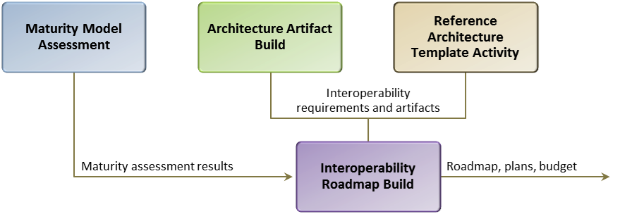

## How to use the maturity model

Evaluate your mission reference architecture and interoperability architecture artifacts developed against the ISE maturity model. The ISE maturity model is broken down by [FEAF](http://en.wikipedia.org/wiki/Federal_enterprise_architecture) common approach domains (business, data, applications and services, security, infrastructure, and performance) with characteristics established for each level of interoperability (adhoc, repeatable, enhanced, managed, and optimized) and for each interoperability requirement. For each element determine the maturity level of your mission architecture by moving across each row and matching your current state. During this step you should also note the characteristics of each requirement where the requirement/element maturity is less than your desired level (Ex., your interoperability level is at 'repeatable'; you need to be at 'managed'). Note that mission-specific architectures will have different goals for each element maturity level based on the operational needs or organizational policy of the mission architecture.

### Use the Reference Architecture Template to Update Applicable Mission Reference Architecture(s)

The reference architecture (RA) template is designed to aid the development of reference architecture artifacts to support interoperability. For each of the domains, the template is a guide to the relevant interoperability requirements and artifacts to be incorporated for interoperability. The template details interoperability goals in each of the domains, as well as instructions for template usage.

The RA template contains an overview of the interoperability goals for each domain and the objectives of the artifacts within the domain. Within each domain listed, the RA template provides an overview of the information to be included in each artifact, and instructions on how to develop each interoperability artifact. Each domain is divided into subsets of the domain. For example, the business domain is divided into business processe,; business models, mission exchange processes, diagrams and flows, other considerations, etc.

In addition, the reference architecture template has been integrated with the Architecture Framework Alignment Grid with mnemonics mapping each item in the template to the applicable artifact reference in the Grid. When used in conjunction with the Architecture Framework Alignment Grid [add link], the architecture framework can be updated to includd interoperability in each domain.

Annually, OMB will receive business and technology architecture information from each department or agency in the form of a high-level, integrated description of the agency's IT-related strategic goals, business objectives, and enabling IT capabilities, to include roadmaps. By leveraging the interoperability baseline provided by the Enterprise Architecture Maturity Measurement Template, OMB can more easily understand the department or agency's progress towards integrating interoperability requirements into their existing architectures while improving their abilities to fulfill strategic priorities.

### Build a Plan/Roadmap to Achieve Desired Interoperability Level for Each Requirement in the Maturity Model

After completing the previous steps and determining which interoperability elements should be incorporated into each enterprise architecture domain, build a plan and roadmap that leads to interoperability at the applicable maturity level for your mission- specific EA. The plan and roadmap should address each interoperability requirement where improvement is deemed necessary. The roadmap should consider the availability of both intra- and inter-agency shared services which will require coordination.

The following graphic is provided to show the relationship between the Maturity Model Assessment, the Architecture Artifact Build, the Reference Architecture Template Activity, and the building of the Interoperability Roadmap, as well as inputs and outputs of each activity. The Interoperability Roadmap build activity will also require the interoperability goals for the specific mission architectures since the maturity level (ad-hoc, repeatable, enhanced, managed, or optimized) goals will be different for each mission architecture based on its needs.

Figure 1.

It would be advantageous to interoperability efforts if this roadmap/plan were maintained to monitor progress towards interoperability goals and to coordinate plans across departments and agencies. Options for monitoring include: 1) [ISA IPC via the Senior Architect's Forum](http://ise.gov/ise-governance), 2) [OMB via E-Gov Initiative](http://www.whitehouse.gov/omb/e-gov), 3) the [Federal CIO Council](https://cio.gov/).

## Interoperability Maturity Model

The Interoperability Maturity Model addresses five domains of interoperability. Each domain is supported by applicable questions and maturity model assessment criteria. Each row in the maturity models represents a functional area within the domain. Each column represents a different stage of maturity. Interdependencies between functional areas exist but the goal is to assess a system independently for each functional area.

### Business Domain Interoperability Objectives

The purpose of the business domain is to ensure that the system, program or reference architecture aligns to an organization's mission requirements and clearly describes the scope, goals, and purpose of the architecture. The business domain typically describes:

* References to policies, guidance, and laws that affect the reference architecture and related mission objectives

* Governance groups responsible for oversight of the reference architecture

* Mission vision, objectives, and requirements

* Lines of business, capabilities, and activities

* Planned achievement of capabilities by timeframes and what constrains/policies apply.

### Interoperability Objectives

Interoperability objectives of the business domain include:

* Description of how a reference architecture supports the operational enterprise

* Incorporating information sharing functions into mission-specific activities (e.g., address the information sharing lifecycle activities such as collection, analysis, dissemination, storage, and retirement)

* Using standards-based approaches to capture business requirements and document business processes and information flows

* Identifying common information exchanges for a specific mission scenario/use case

* Capturing information sharing requirements, constraints, and rules between partners.

### Assessment

The Business Domain maturity model is divided into functions or process groups (rows) and maturity levels (column). The maturity model is followed by several supporting questions.

_Image model2 here_

### Data Domain Interoperability Objective

The purpose of the data domain is to describe what data is available to promote the common identification, use, and appropriate sharing of data/information across the government. It provides guidance for consistently describing, categorizing, and sharing data, and facilitates the discovery and exchange of information across boundaries. It describes structure (logical and schema) of the data/information at a level necessary for users to understand both what types of data/information is available and the data's structure. The semantic meaning of the data/information should also be addressed within this domain in order to enable the interoperability of the data/information to be exchanged. This domain typically describes how:

* Data is classified within a given data source by the mission or business context in which the data is used

* Structured, semi-structured, and unstructured data is stored, managed, and used in a system

* Services and processes reference and manipulate data

* Business context is applied to data so that it can be searched

* Standardization of information exchange between information sharing partners.

### Interoperability Objectives

Interoperability objectives of the data domain include:

* Describing how data is structured, what standards are used, how data/information can be exchanged so users are able to both have access to and use the data/information

* Specify/describe the data/information flow, including tagging, discovery, and retrieval of the data

* Demonstrating the commonly occurring need for exchanges of data/information between the domain and users

* Describing how data/information is secured throughout the lifecycle

* Specifying how data/information is tagged/structured, and how specific data tagging standards are used

* Describing principles, roles, and responsibilities for data management and stewardship.

### Assessment

The Data Domain maturity model is divided into functions or process groups (rows) and maturity levels (column). The maturity model is followed by several supporting questions.

_Image model3 here._

### Applications and Services Domain Objectives

The applications and services domain describes the technical services supporting the common activities used for discovering, identifying, distributing, protecting, and managing the data/information that external users require. It should:

* Provide any applicable service standards, application architecture approaches (e.g., SOA), or other information required to interact with the applications/services within the domain

* Describe the relationships between systems, applications, and interfaces

### Interoperability Objectives

Interoperability objectives of the applications and services domain include:

* Capturing the specifications and functional requirements of the applications/services to the level necessary so external application developers can interface with applications/services

* Describing recommended and/or possible implementation approaches (e.g., cloud, SOA, mobile)

* Identifying services and common activities, their service components, and the interfaces/interconnections between the services and data assets that are exchanged

* Identifying the functions performed by the applications/services and any constraints on the data used and the flow of the data

* Specifying service standards used or required by the applications/services

* Specifying rules/laws with respect to products, data, and/or information generated by the applications/services

* Publishing/exposing application programming interfaces (APIs) so future users can access and create applications with the data/information, and describing how the developers access the APIs

* Describing extensibility approaches for future users/applications to add additional functionality

* Describing how application architecture scales for more users

* Describing how services are made discoverable

* Specifying the provider and user roles and responsibilities with respect to application/service lifecycle (from development to operations and maintenance, to retirement)

### Assessment

The Applications and Services Domain maturity model is divided into functions or process groups (rows) and maturity levels (column). The maturity model is followed by several supporting questions.

_Image: model4_

## SECURITY Domain Interoperability Objectives

The purpose of security domain is to describe the security policies and considerations required for external users that need to interface and get access to the data/information. The Interoperability Maturity Matrix uses [the Federal Identity, Credential and Access Management (ICAM) Maturity Model](http://www.idmanagement.gov/documents/icam-maturity-model) to assess the progress of an agency's business processes and technical capabilities against the ICAM segment architecture, as related to interoperability within the security domain.

### Interoperability Objectives

Interoperability objectives of the security domain include:

* Describing how proper security controls are used by the architecture to ensure data/information protection and allow access by external users

* Describing high-level security needs from an interoperability perspective, such as the use of common security standards/protocols

* Identifying controls required for specific types of information and any handling caveats (i.e., address confidentiality, integrity, and availability requirements)

* Describing how proper security controls are used to ensure data protection and ensure access

* Determining if information must be exchanged across different security enclaves

* Using metadata to tag data and describe its pedigree, lineage, source, timeliness, confidence, or other attributes associated with trust

* Identifying digital security rules, guidelines, and standards for securely exchanging data and services across security domains

* Describing, with enough detail for an external application developer, the event trace of the interactions of the architecture with regard to security controls

* Describing the identity management system used to allow/deny access to the data/information (i.e., role or attribute based)

* Describing the plan to manage/control your identity accounts and provide access controls to systems (for users, system administrators, developers, and super users)

* Describing how new users/developers are granted access to the data/information at all stages of the lifecycle

* Describing data/information access audit methods or standards, include the lifecycle for the storage of the audit data

### Performance Domain Interoperability Objectives

The purpose of the performance domain is to provide linkage to investments or activities and an organization's strategic vision. This domain typically:

* Provides a direct line of sight between strategic planning and the investment review process

* Identifies common performance elements across investments or activities

* Provides a high-level overview of recommended metrics to be considered that will measure the successes of the architecture (inputs, outputs, and outcomes).

### Interoperability Objectives

Interoperability objectives of the performance domain include:

* Define performance goals that align to applicable [policy, guidance and laws](/authorities/)

* Review investments and ensure they clearly incorporate [interoperability requirements and adhere to relevant performance goals](http://www.ise.gov/ise-performance-management)

### Assessment

The Performance Domain maturity model is divided into functions or process groups (rows) and maturity levels (column). The maturity model is followed by several supporting questions.

_Image model5 here_
